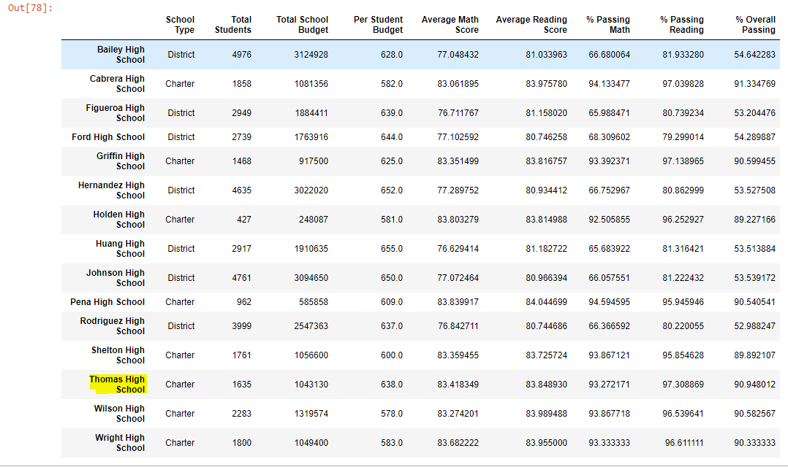

# School District Analysis
## Overiew of Project
Maria is the chief data scientist for a city school district. She is given the task of collecting the district's standardized test data, to conduct an analysis, and present insights about students' performance trends. She will present her findings to the city's school board of directors. She enlisted my help to aggregate, clean, analyze, and format the data using Jupyter Notebook and the Pandas software library.
### Purpose
I will use the PythonData development environment within Jupyter Notebook to conduct the following calculations and summaries:
+ Replace Thomas High School's 9th-grade test scores with Nan, which was reported for academic dishonesty.
+ Update the values in all the summaries.
  + Update the school district summary which encapsulates the overall performance of the whole district.
  + Update the school summary which outlines performance on a per-school basis.
  + Update the summary that reflects the top five performing schools and the bottom five performing schools.
  + Update the summary that compares only the math and reading scores of each school. It is categorized by grade level.
  + Update the school spending summary which evaluates performance in comparison to a school's total budget.
  + Update the scores by size summary which examines performance based on the schools' total student population.
+ Repeat the full school analysis to see how the overall analysis was affected by the annulled scores.
## Results
### District Summary
The updated district summary is only marginally affected by the annulled test scores. The passing percentage for reading scores dropped from 86% to 85.7%, about a 0.3% difference. The passing percentage for math scores dropped from 75% to 74.8%, about a 0.2% difference. The overall passing percentage dropped by less than .1%.

**Original district summary**

**New district summary**

### School Summary
The school summary was modified to reflect the removal of the 9th-grade level test scores for Thomas High School.  In the previous summary analysis, I am not surprised to discover that scores of one grade level specific to a school, did not impact the overall district. However, I am surprised to discover that the removal of scores marginally impacted the school's passing percentages. The passing percentage for reading scores dropped from 84% to 83.9%, less than a 0.1% difference. The passing percentage for math scores dropped from 93.3% to 93.2%, again less than a 0.1% difference. The overall passing percentage dropped by .3%.

**Original school summary**

**New school summary**

### How does replacing the ninth graders’ math and reading scores affect Thomas High School’s performance relative to the other schools?
Before replacing Thomas High School's 9th grade test scores, the school was ranked within the top 5 best performing school. It was ranked second best. After I removed the 9th grade test scores, it was still ranked the second best performing school. It's overall passing percentage only dropped from 91% to 90.6%, a 0.4% percent difference.
### How does replacing the ninth-grade scores affect the following?
+ **Math and reading scores by grade**
Math and reading scores of 9-12th grade vs 10-12th grade were minimally affected. The difference was less than 0.1-0.4%. It did not even change the outcome of the table.
+ **Schools by school spending**
The 9th grade test scores had zero impact on the schools spending summary. The total budget per school remains the same. The spending range per student is not affected because the student count values were not removed. Only the test scores were annulled. No other data was removed.
+ **Scores by school size**
The 9th grade test scores had zero impact on the school sizes. The size per school remains the same. No other data was removed.
+ **Scores by school type**
The 9th grade test scores had minimum to zero impact on the school type overall passing percentage. The difference was less than 0.1-0.4%. It did not even change the outcome of the table.
## Summary
